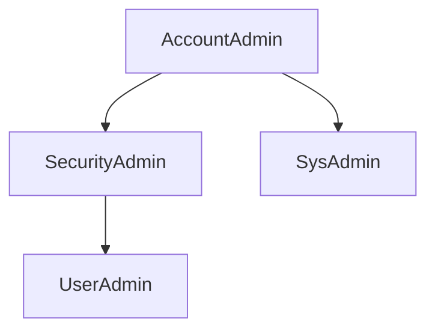

# snowflake-learning

## Table
* [High Level Overview of Snowflake](documents/high-level.md)
* [Data Sharing](documents/datasharing.md)


## Materials
* [Snowflake community](https://community.snowflake.com/)
* [GitHub](??)
* [Learning Snowflake](https://learn.snowflake.com/)

## Identity and Access
Identity: Who you are. If identified, called authenticated. Processes - OSS, SAML, SCIM, FEDAUTH, MFA, LDP
Access: What you are allowed to see / do. If enabled, called authorized. Processes - DISCRETIONARY, ROLE BASED (RBAC), IP POLICIES

User can change role.

Scale up and down -> Vertical scaling
Scaling out and snapping back - Auto scale - elastic data warehouse -> Horizontal scaling

All the warehouse has just one cluster in a non-scaled mode. Just with different size of compute to begin with.

alter table rename -> to move the table

## Load

### Stages
Stages or Staging Areas are places to put things temporarily before moving them to a more stable location. They are more like cloud folders or directories so that Snowflake service can pick them up and pull them into database structures quickly and securely. Snowflake has two types of stages:
* Internal stages which act almost like directories inside a snowflake accounts local storage.
* External stages - these act more than a secure gateway between cloud storage services and snowflake services.

Notice that Snowflake doesn't care about capitalization. Snowflake always assumes you really mean to type everything in UPPER CASE so it converts it for you. Because of this, you can type lower case or mixed case when creating or querying objects, and Snowflake will convert it to all upper-case behind the scenes.

(Unless you use quotes when creating things, and then you'll have to use quotes forever after that to deal with the object.)

So, when running commands on the Stage, any case spelling will work. However, S3 is very particular, so once you get past the Stage Object name, you have to be very disciplined. You have to use the exact spelling - with correct cases, even for the file extension.

Pre-Stage Data Movement = Data coming from external sources. AWS provides three tools to load the data into Snowflake.
* Amazon Transfer for FTP
* Amazon CLI
* Standard Web Browser.
  It also allows to load the files into their S3 buckets programmatically using Python, REST API and Java. Or, external Third Party FTP Utilities.

**copy into**

## Data Storage Structures
```
    |   Structured: RDBMS databases, csv
    |   Semi-structured: XML, JSON, Parquet, AVRO, ORC
    |   Quasi-Structured: Clickstream
    v   Unstructured: Images, PDFs, Videos.
Increased growth
```

ERD - Normalized and Relational

3NF - Different entities in separate tables, same info not repeated unnecessarily, unique IDs for each row.

Sequence - counter for unique ID.


## Nested Semi-Structured Data
Nested pattern of any data set is called an object model.

In JSON, attributes are called the keys and along with its value, a key-value pair.
* Every entity is surrounded by { }.
* Key and values are separated by colon.
* Each key-value pair is separated by comma.

We use PATHS to extract the data. Parent:Child format. If the child is further nested, Parent:Child[0]:GrandChild.


URL = https://jl04667.eu-west-2.aws.snowflakecomputing.com/
UserID = ABHIKUMAR

```
create or replace table ROOT_DEPTH (
   ROOT_DEPTH_ID number(1), 
   ROOT_DEPTH_CODE text(1), 
   ROOT_DEPTH_NAME text(7), 
   UNIT_OF_MEASURE text(2),
   RANGE_MIN number(2),
   RANGE_MAX number(2)
   ); 
   
   
   INSERT INTO ROOT_DEPTH (ROOT_DEPTH_ID ,ROOT_DEPTH_CODE ,ROOT_DEPTH_NAME ,UNIT_OF_MEASURE ,RANGE_MIN ,RANGE_MAX ) VALUES (1,'S','Shallow','cm',30,45);
   INSERT INTO ROOT_DEPTH (ROOT_DEPTH_ID ,ROOT_DEPTH_CODE ,ROOT_DEPTH_NAME ,UNIT_OF_MEASURE ,RANGE_MIN ,RANGE_MAX ) VALUES (2,'M','Medium','cm',45,60);
   INSERT INTO ROOT_DEPTH (ROOT_DEPTH_ID ,ROOT_DEPTH_CODE ,ROOT_DEPTH_NAME ,UNIT_OF_MEASURE ,RANGE_MIN ,RANGE_MAX ) VALUES (3,'D','Deep','cm',60,90);

SELECT *
FROM ROOT_DEPTH
LIMIT 1;

create table vegetable_details
(
plant_name varchar(25)
, root_depth_code varchar(1)    
);


CREATE FILE FORMAT "GARDEN_PLANTS"."VEGGIES".COMMASEP_DBLQUOT_ONEHEADROW TYPE = 'CSV' COMPRESSION = 'AUTO' FIELD_DELIMITER = ',' RECORD_DELIMITER = '\n' SKIP_HEADER = 0 FIELD_OPTIONALLY_ENCLOSED_BY = '\042' TRIM_SPACE = FALSE ERROR_ON_COLUMN_COUNT_MISMATCH = TRUE ESCAPE = 'NONE' ESCAPE_UNENCLOSED_FIELD = '\134' DATE_FORMAT = 'AUTO' TIMESTAMP_FORMAT = 'AUTO' NULL_IF = ('\\N');

select * from vegetable_details;

delete from vegetable_details where plant_name = 'Spinach';

insert into vegetable_details values ('Spinach', 'S');


use role accountadmin;
create or replace api integration dora_api_integration
api_provider = aws_api_gateway
api_aws_role_arn = 'arn:aws:iam::321463406630:role/snowflakeLearnerAssumedRole'
enabled = true
api_allowed_prefixes = ('https://awy6hshxy4.execute-api.us-west-2.amazonaws.com/dev/edu_dora');

use role accountadmin;  
use database demo_db; 
create or replace external function grader(
      step varchar
    , passed boolean
    , actual integer
    , expected integer
    , description varchar)
returns variant
api_integration = dora_api_integration 
context_headers = (current_timestamp,current_account, current_statement) 
as 'https://awy6hshxy4.execute-api.us-west-2.amazonaws.com/dev/edu_dora/grader'
; 


select demo_db.public.grader(step, (actual = expected), actual, expected, description) as graded_results from
(SELECT 
 'DORA_IS_WORKING' as step
 ,(select 223 ) as actual
 ,223 as expected
 ,'Dora is working!' as description
); 

SELECT * 
FROM GARDEN_PLANTS.INFORMATION_SCHEMA.SCHEMATA;

SELECT * 
FROM GARDEN_PLANTS.INFORMATION_SCHEMA.SCHEMATA
where schema_name in ('FLOWERS','FRUITS','VEGGIES'); 


SELECT count(*) as SCHEMAS_FOUND, '3' as SCHEMAS_EXPECTED 
FROM GARDEN_PLANTS.INFORMATION_SCHEMA.SCHEMATA
where schema_name in ('FLOWERS','FRUITS','VEGGIES'); 

SELECT 'VEGGIES_SCHEMA_EXISTS' as step
,(select count(*) from GARDEN_PLANTS.INFORMATION_SCHEMA.SCHEMATA where schema_name = 'VEGGIES') as actual
,1 as expected
,'Check if schema exists.' as description
UNION ALL
SELECT 'FRUITS_SCHEMA_EXISTS' as step
,(select count(*) from GARDEN_PLANTS.INFORMATION_SCHEMA.SCHEMATA where schema_name = 'FRUITS') as actual
,1 as expected
,'Check if schema exists.' as description;

SELECT
 'VEGGIES_SCHEMA_EXISTS' as step
 ,(select count(*) from GARDEN_PLANTS.INFORMATION_SCHEMA.SCHEMATA where schema_name = 'VEGGIES') as actual
 ,1 as expected
 ,'Check if schema exists.' as description
 UNION ALL
 SELECT
 'FRUITS_SCHEMA_EXISTS' as step
 ,(select count(*) from GARDEN_PLANTS.INFORMATION_SCHEMA.SCHEMATA where schema_name = 'FRUITS') as actual
 ,1 as expected
 ,'Check if schema exists.' as description
 UNION ALL
 SELECT
 'FLOWERS_SCHEMA_EXISTS' as step
 ,(select count(*) from GARDEN_PLANTS.INFORMATION_SCHEMA.SCHEMATA where schema_name = 'FLOWERS') as actual
 ,1 as expected
 ,'Check if schema exists.' as description
 ;
 
 
 SELECT
 'DWW01_3_SCHEMAS_EXIST' as step
 ,(select count(*) from GARDEN_PLANTS.INFORMATION_SCHEMA.SCHEMATA where schema_name in ('FLOWERS','VEGGIES','FRUITS')) as actual
 ,3 as expected
 ,'Check if schema exists.' as description
  UNION ALL
 SELECT
 'DWW02_PUBLIC_SCHEMA_DELETED' as step
 ,(select count(*) from GARDEN_PLANTS.INFORMATION_SCHEMA.SCHEMATA where schema_name = 'PUBLIC') as actual
 ,0 as expected
 ,'Check if schema was deleted.' as description
  UNION ALL
 SELECT
 'DWW03_ROOT_DEPTH_TABLE_EXISTS' as step
 ,(select count(*) from GARDEN_PLANTS.INFORMATION_SCHEMA.TABLES where table_name = 'ROOT_DEPTH') as actual
 ,1 as expected
 ,'Check if table was created.' as description
   UNION ALL
 SELECT
 'DWW04_ROOT_DEPTH_TABLE_EXISTS' as step
 ,(select count(*) from GARDEN_PLANTS.INFORMATION_SCHEMA.TABLES where table_name = 'ROOT_DEPTH') as actual
 ,1 as expected
 ,'Check if table was created.' as description
   UNION ALL
 SELECT
 'DWW05_VEG_DETAILS_TABLE_EXISTS' as step
 ,(select count(*) from GARDEN_PLANTS.INFORMATION_SCHEMA.TABLES where table_name = 'VEGETABLE_DETAILS') as actual
 ,1 as expected
 ,'Check if table was created.' as description
   UNION ALL
 SELECT
 'DWW06_ROOT_DEPTH_ROW_COUNT' as step
 ,(select row_count from GARDEN_PLANTS.INFORMATION_SCHEMA.TABLES where table_name = 'ROOT_DEPTH') as actual
 ,3 as expected
 ,'Check number of rows.' as description
UNION ALL
 SELECT
 'DWW07_VEG_DETAILS_ROW_COUNT' as step
 ,(select row_count from GARDEN_PLANTS.INFORMATION_SCHEMA.TABLES where table_name = 'VEGETABLE_DETAILS') as actual
 ,41 as expected
 ,'Check number of rows.' as description
 UNION ALL
 SELECT
 'DWW08_COMMA_DBLQUOTE_FF_EXISTS' as step
 ,(select count(*) from GARDEN_PLANTS.INFORMATION_SCHEMA.FILE_FORMATS where FIELD_DELIMITER =',' and FIELD_OPTIONALLY_ENCLOSED_BY ='"') as actual
 ,1 as expected
 ,'Check file format with certain config exists.' as description
  UNION ALL
 SELECT
 'DWW09_PIPE_TRIMSPACE_FF_EXISTS' as step
 ,(select count(*) from GARDEN_PLANTS.INFORMATION_SCHEMA.FILE_FORMATS where FIELD_DELIMITER ='|' and TRIM_SPACE ='true') as actual
 ,1 as expected
 ,'Check file format with certain config exists.' as description
 ;
 
 
 
 select DEMO_DB.PUBLIC.GRADER(step, (actual = expected), actual, expected, description) as graded_results from
(
 SELECT
 'DWW01_3_SCHEMAS_EXIST' as step
 ,(select count(*) from GARDEN_PLANTS.INFORMATION_SCHEMA.SCHEMATA where schema_name in ('FLOWERS','VEGGIES','FRUITS')) as actual
 ,3 as expected
 ,'Check if schema exists.' as description
  UNION ALL
 SELECT
 'DWW02_PUBLIC_SCHEMA_DELETED' as step
 ,(select count(*) from GARDEN_PLANTS.INFORMATION_SCHEMA.SCHEMATA where schema_name = 'PUBLIC') as actual
 ,0 as expected
 ,'Check if schema was deleted.' as description
  UNION ALL
 SELECT
 'DWW03_ROOT_DEPTH_TABLE_EXISTS' as step
 ,(select count(*) from GARDEN_PLANTS.INFORMATION_SCHEMA.TABLES where table_name = 'ROOT_DEPTH') as actual
 ,1 as expected
 ,'Check if table was created.' as description
   UNION ALL
 SELECT
 'DWW04_ROOT_DEPTH_TABLE_EXISTS' as step
 ,(select count(*) from GARDEN_PLANTS.INFORMATION_SCHEMA.TABLES where table_name = 'ROOT_DEPTH') as actual
 ,1 as expected
 ,'Check if table was created.' as description
   UNION ALL
 SELECT
 'DWW05_VEG_DETAILS_TABLE_EXISTS' as step
 ,(select count(*) from GARDEN_PLANTS.INFORMATION_SCHEMA.TABLES where table_name = 'VEGETABLE_DETAILS') as actual
 ,1 as expected
 ,'Check if table was created.' as description
   UNION ALL
 SELECT
 'DWW06_ROOT_DEPTH_ROW_COUNT' as step
 ,(select row_count from GARDEN_PLANTS.INFORMATION_SCHEMA.TABLES where table_name = 'ROOT_DEPTH') as actual
 ,3 as expected
 ,'Check number of rows.' as description
UNION ALL
 SELECT
 'DWW07_VEG_DETAILS_ROW_COUNT' as step
 ,(select row_count from GARDEN_PLANTS.INFORMATION_SCHEMA.TABLES where table_name = 'VEGETABLE_DETAILS') as actual
 ,41 as expected
 ,'Check number of rows.' as description
 UNION ALL
 SELECT
 'DWW08_COMMA_DBLQUOTE_FF_EXISTS' as step
 ,(select count(*) from GARDEN_PLANTS.INFORMATION_SCHEMA.FILE_FORMATS where FIELD_DELIMITER =',' and FIELD_OPTIONALLY_ENCLOSED_BY ='"') as actual
 ,1 as expected
 ,'Check file format with certain config exists.' as description
  UNION ALL
 SELECT
 'DWW09_PIPE_TRIMSPACE_FF_EXISTS' as step
 ,(select count(*) from GARDEN_PLANTS.INFORMATION_SCHEMA.FILE_FORMATS where FIELD_DELIMITER ='|' and TRIM_SPACE ='true') as actual
 ,1 as expected
 ,'Check file format with certain config exists.' as description
 );
 
 list@like_a_window_into_an_s3_bucket;


create or replace table vegetable_details_soil_type
( plant_name varchar(25)
 ,soil_type number(1,0)
);

copy into vegetable_details_soil_type
from @like_a_window_into_an_s3_bucket
files = ( 'VEG_NAME_TO_SOIL_TYPE_PIPE.txt')
file_format = ( format_name=PIPECOLSEP_ONEHEADROW );


create or replace table LU_SOIL_TYPE(
SOIL_TYPE_ID number,	
SOIL_TYPE varchar(15),
SOIL_DESCRIPTION varchar(75)
 );
 
 truncate table LU_SOIL_TYPE;

copy into LU_SOIL_TYPE
from @like_a_window_into_an_s3_bucket
files = ( 'LU_SOIL_TYPE.tsv')
file_format = ( format_name=L8_CHALLENGE_FF );

create or replace table VEGETABLE_DETAILS_PLANT_HEIGHT (
    plant_name varchar(30),
    UOM varchar(1),
    low_end_of_range number,
    high_end_of_range number
);

copy into VEGETABLE_DETAILS_PLANT_HEIGHT
from @like_a_window_into_an_s3_bucket
files = ( 'veg_plant_height.csv')
file_format = ( format_name=COMMASEP_DBLQUOT_ONEHEADROW );

select count(*) from vegetable_details_plant_height;


// Create a new database and set the context to use the new database
CREATE DATABASE LIBRARY_CARD_CATALOG COMMENT = 'DWW Lesson 9 ';
USE DATABASE LIBRARY_CARD_CATALOG;

// Create and Author table
CREATE OR REPLACE TABLE AUTHOR (
   AUTHOR_UID NUMBER 
  ,FIRST_NAME VARCHAR(50)
  ,MIDDLE_NAME VARCHAR(50)
  ,LAST_NAME VARCHAR(50)
);

// Insert the first two authors into the Author table
INSERT INTO AUTHOR(AUTHOR_UID,FIRST_NAME,MIDDLE_NAME, LAST_NAME) 
Values
(1, 'Fiona', '','Macdonald')
,(2, 'Gian','Paulo','Faleschini');

// Look at your table with it's new rows
SELECT * 
FROM AUTHOR;

//Drop and recreate the counter (sequence) so that it starts at 3 
// then we'll add the other author records to our author table
CREATE OR REPLACE SEQUENCE SEQ_AUTHOR_UID 
START 3 
INCREMENT 1 
COMMENT = 'Use this to fill in the AUTHOR_UID everytime you add a row';

//Add the remaining author records and use the nextval function instead 
//of putting in the numbers
INSERT INTO AUTHOR(AUTHOR_UID,FIRST_NAME,MIDDLE_NAME, LAST_NAME) 
Values
(SEQ_AUTHOR_UID.nextval, 'Laura', 'K','Egendorf')
,(SEQ_AUTHOR_UID.nextval, 'Jan', '','Grover')
,(SEQ_AUTHOR_UID.nextval, 'Jennifer', '','Clapp')
,(SEQ_AUTHOR_UID.nextval, 'Kathleen', '','Petelinsek');


// Create a new sequence, this one will be a counter for the book table
CREATE OR REPLACE SEQUENCE SEQ_BOOK_UID 
START 1 
INCREMENT 1 
COMMENT = 'Use this to fill in the BOOK_UID everytime you add a row';

// Create the book table and use the NEXTVAL as the 
// default value each time a row is added to the table
CREATE OR REPLACE TABLE BOOK
( BOOK_UID NUMBER DEFAULT SEQ_BOOK_UID.nextval
 ,TITLE VARCHAR(50)
 ,YEAR_PUBLISHED NUMBER(4,0)
);

// Insert records into the book table
// You don't have to list anything for the
// BOOK_UID field because the default setting
// will take care of it for you
INSERT INTO BOOK(TITLE,YEAR_PUBLISHED)
VALUES
 ('Food',2001)
,('Food',2006)
,('Food',2008)
,('Food',2016)
,('Food',2015);

// Create the relationships table
// this is sometimes called a "Many-to-Many table"
CREATE TABLE BOOK_TO_AUTHOR
(  BOOK_UID NUMBER
  ,AUTHOR_UID NUMBER
);

//Insert rows of the known relationships
INSERT INTO BOOK_TO_AUTHOR(BOOK_UID,AUTHOR_UID)
VALUES
 (1,1) // This row links the 2001 book to Fiona Macdonald
,(1,2) // This row links the 2001 book to Gian Paulo Faleschini
,(2,3) // Links 2006 book to Laura K Egendorf
,(3,4) // Links 2008 book to Jan Grover
,(4,5) // Links 2016 book to Jennifer Clapp
,(5,6);// Links 2015 book to Kathleen Petelinsek


//Check your work by joining the 3 tables together
//You should get 1 row for every author
select * 
from book_to_author ba 
join author a 
on ba.author_uid = a.author_uid 
join book b 
on b.book_uid=ba.book_uid; 


SELECT
 'DWW10_EXTERNAL_STAGE_EXISTS' as step
 ,(SELECT count(*) from GARDEN_PLANTS.INFORMATION_SCHEMA.stages
where stage_url='s3://uni-lab-files' and stage_type='External Named') as actual
 ,1 as expected
 ,'Check stage exists' as description
UNION ALL
 SELECT
 'DWW11_VEG_SOIL_ROW_COUNT' as step
 ,(select row_count from GARDEN_PLANTS.INFORMATION_SCHEMA.TABLES where table_name = 'VEGETABLE_DETAILS_SOIL_TYPE') as actual
 ,42 as expected
 ,'Check number of rows' as description
   UNION ALL
  SELECT
 'DWW12_VEG_HEIGHT_ROW_COUNT' as step
 ,(select row_count from GARDEN_PLANTS.INFORMATION_SCHEMA.TABLES where table_name = 'VEGETABLE_DETAILS_PLANT_HEIGHT') as actual
 ,41 as expected
 ,'Check number of rows' as description
    UNION ALL
  SELECT
 'DWW13_SOIL_LU_ROW_COUNT' as step
 ,(select row_count from GARDEN_PLANTS.INFORMATION_SCHEMA.TABLES where table_name = 'LU_SOIL_TYPE') as actual
 ,8 as expected
 ,'Check number of rows' as description
 UNION ALL
 SELECT
 'DWW14_L8_CHALLENGE_FF' as step
 ,(select count(*) from GARDEN_PLANTS.INFORMATION_SCHEMA.FILE_FORMATS where FILE_FORMAT_NAME='L8_CHALLENGE_FF' and FIELD_DELIMITER = '\t') as actual
 ,1 as expected
,'Check if table was created.' as description
  UNION ALL
  SELECT
 'DWW15_LITTLE_BOOK_3NF' as step
 ,(Select count(*) from LIBRARY_CARD_CATALOG.PUBLIC.Book_to_Author ba join LIBRARY_CARD_CATALOG.PUBLIC.author a on ba.author_uid = a.author_uid join LIBRARY_CARD_CATALOG.PUBLIC.book b on b.book_uid=ba.book_uid) as actual
 ,6 as expected
,'Check if 3NF DB was created.' as description;


select DEMO_DB.PUBLIC.GRADER(step, (actual = expected), actual, expected, description) as graded_results from
(
SELECT
 'DWW10_EXTERNAL_STAGE_EXISTS' as step
 ,(SELECT count(*) from GARDEN_PLANTS.INFORMATION_SCHEMA.stages
where stage_url='s3://uni-lab-files' and stage_type='External Named') as actual
 ,1 as expected
 ,'Check stage exists' as description
UNION ALL
 SELECT
 'DWW11_VEG_SOIL_ROW_COUNT' as step
 ,(select row_count from GARDEN_PLANTS.INFORMATION_SCHEMA.TABLES where table_name = 'VEGETABLE_DETAILS_SOIL_TYPE') as actual
 ,42 as expected
 ,'Check number of rows' as description
   UNION ALL
  SELECT
 'DWW12_VEG_HEIGHT_ROW_COUNT' as step
 ,(select row_count from GARDEN_PLANTS.INFORMATION_SCHEMA.TABLES where table_name = 'VEGETABLE_DETAILS_PLANT_HEIGHT') as actual
 ,41 as expected
 ,'Check number of rows' as description
    UNION ALL
  SELECT
 'DWW13_SOIL_LU_ROW_COUNT' as step
 ,(select row_count from GARDEN_PLANTS.INFORMATION_SCHEMA.TABLES where table_name = 'LU_SOIL_TYPE') as actual
 ,8 as expected
 ,'Check number of rows' as description
 UNION ALL
 SELECT
 'DWW14_L8_CHALLENGE_FF' as step
 ,(select count(*) from GARDEN_PLANTS.INFORMATION_SCHEMA.FILE_FORMATS where FILE_FORMAT_NAME='L8_CHALLENGE_FF' and FIELD_DELIMITER = '\t') as actual
 ,1 as expected
,'Check if table was created.' as description
  UNION ALL
  SELECT
 'DWW15_LITTLE_BOOK_3NF' as step
 ,(Select count(*) from LIBRARY_CARD_CATALOG.PUBLIC.Book_to_Author ba join LIBRARY_CARD_CATALOG.PUBLIC.author a on ba.author_uid = a.author_uid join LIBRARY_CARD_CATALOG.PUBLIC.book b on b.book_uid=ba.book_uid) as actual
 ,6 as expected
,'Check if 3NF DB was created.' as description
 );
 
CREATE TABLE LIBRARY_CARD_CATALOG.PUBLIC.AUTHOR_INGEST_XML 
(
  "RAW_AUTHOR" VARIANT
);


CREATE or replace FILE FORMAT LIBRARY_CARD_CATALOG.PUBLIC.XML_FILE_FORMAT 
TYPE = 'XML' 
COMPRESSION = 'AUTO' 
PRESERVE_SPACE = FALSE 
STRIP_OUTER_ELEMENT = TRUE 
DISABLE_SNOWFLAKE_DATA = FALSE 
DISABLE_AUTO_CONVERT = FALSE 
IGNORE_UTF8_ERRORS = FALSE;

list @garden_plants.veggies.like_a_window_into_an_s3_bucket;

truncate table author_ingest_xml;

select * from author_ingest_xml;

copy into AUTHOR_INGEST_XML
from @garden_plants.veggies.like_a_window_into_an_s3_bucket
files = ( 'author_with_header.xml')
file_format = ( format_name= XML_FILE_FORMAT);


//Returns entire record
SELECT raw_author 
FROM author_ingest_xml;

// Presents a kind of meta-data view of the data
SELECT raw_author:"$" 
FROM author_ingest_xml; 

//shows the root or top-level object name of each row
SELECT raw_author:"@" 
FROM author_ingest_xml; 

//returns AUTHOR_UID value from top-level object's attribute
SELECT raw_author:"@AUTHOR_UID"
FROM author_ingest_xml;

//returns value of NESTED OBJECT called FIRST_NAME
SELECT XMLGET(raw_author, 'FIRST_NAME'):"$"
FROM author_ingest_xml;

//returns the data in a way that makes it look like a normalized table
SELECT 
raw_author:"@AUTHOR_UID" as AUTHOR_ID
,XMLGET(raw_author, 'FIRST_NAME'):"$" as FIRST_NAME
,XMLGET(raw_author, 'MIDDLE_NAME'):"$" as MIDDLE_NAME
,XMLGET(raw_author, 'LAST_NAME'):"$" as LAST_NAME
FROM AUTHOR_INGEST_XML;

//add ::STRING to cast the values into strings and get rid of the quotes
SELECT 
raw_author:"@AUTHOR_UID" as AUTHOR_ID
,XMLGET(raw_author, 'FIRST_NAME'):"$"::STRING as FIRST_NAME
,XMLGET(raw_author, 'MIDDLE_NAME'):"$"::STRING as MIDDLE_NAME
,XMLGET(raw_author, 'LAST_NAME'):"$"::STRING as LAST_NAME
FROM AUTHOR_INGEST_XML;

USE LIBRARY_CARD_CATALOG;

// Create an Ingestion Table for JSON Data
CREATE TABLE AUTHOR_INGEST_JSON 
(
  "RAW_AUTHOR" VARIANT
);

//Create File Format for JSON Data
CREATE or replace FILE FORMAT LIBRARY_CARD_CATALOG.PUBLIC.JSON_FILE_FORMAT 
TYPE = 'JSON' 
COMPRESSION = 'AUTO' 
ENABLE_OCTAL = FALSE
ALLOW_DUPLICATE = FALSE 
STRIP_OUTER_ARRAY = TRUE
STRIP_NULL_VALUES = FALSE 
IGNORE_UTF8_ERRORS = FALSE; 

copy into AUTHOR_INGEST_JSON
from @garden_plants.veggies.like_a_window_into_an_s3_bucket
files = ( 'author_with_header.json')
file_format = ( format_name= JSON_FILE_FORMAT);

truncate table author_ingest_json;


//returns AUTHOR_UID value from top-level object's attribute
select raw_author:AUTHOR_UID
from author_ingest_json;

//returns the data in a way that makes it look like a normalized table
// :: is called cast
SELECT 
 raw_author:AUTHOR_UID
,raw_author:FIRST_NAME::STRING as FIRST_NAME
,raw_author:MIDDLE_NAME::STRING as MIDDLE_NAME
,raw_author:LAST_NAME::STRING as LAST_NAME
FROM AUTHOR_INGEST_JSON;

CREATE OR REPLACE TABLE LIBRARY_CARD_CATALOG.PUBLIC.NESTED_INGEST_JSON 
(
  "RAW_NESTED_BOOK" VARIANT
);

list @garden_plants.veggies.like_a_window_into_an_s3_bucket;

copy into NESTED_INGEST_JSON
from @garden_plants.veggies.like_a_window_into_an_s3_bucket
files = ( 'json_book_author_nested.txt')
file_format = ( format_name= JSON_FILE_FORMAT);


SELECT RAW_NESTED_BOOK
FROM NESTED_INGEST_JSON;

SELECT RAW_NESTED_BOOK:year_published
FROM NESTED_INGEST_JSON;

SELECT RAW_NESTED_BOOK:authors
FROM NESTED_INGEST_JSON;

//try changing the number in the bracketsd to return authors from a different row
SELECT RAW_NESTED_BOOK:authors[0].first_name
FROM NESTED_INGEST_JSON;

//Use these example flatten commands to explore flattening the nested book and author data
SELECT value:first_name
FROM NESTED_INGEST_JSON
,LATERAL FLATTEN(input => RAW_NESTED_BOOK:authors);

SELECT value:first_name
FROM NESTED_INGEST_JSON
,table(flatten(RAW_NESTED_BOOK:authors));

//Add a CAST command to the fields returned
SELECT value:first_name::VARCHAR, value:last_name::VARCHAR
FROM NESTED_INGEST_JSON
,LATERAL FLATTEN(input => RAW_NESTED_BOOK:authors);

//Assign new column  names to the columns using "AS"
SELECT value:first_name::VARCHAR AS FIRST_NM
, value:last_name::VARCHAR AS LAST_NM
FROM NESTED_INGEST_JSON
,LATERAL FLATTEN(input => RAW_NESTED_BOOK:authors);


//Create a new database to hold the Twitter file
CREATE DATABASE SOCIAL_MEDIA_FLOODGATES 
COMMENT = 'There\'s so much data from social media - flood warning';

USE DATABASE SOCIAL_MEDIA_FLOODGATES;

//Create a table in the new database
CREATE TABLE SOCIAL_MEDIA_FLOODGATES.PUBLIC.TWEET_INGEST 
("RAW_STATUS" VARIANT) 
COMMENT = 'Bring in tweets, one row per tweet or status entity';

//Create a JSON file format in the new database
CREATE FILE FORMAT SOCIAL_MEDIA_FLOODGATES.PUBLIC.JSON_FILE_FORMAT 
TYPE = 'JSON' 
COMPRESSION = 'AUTO' 
ENABLE_OCTAL = FALSE 
ALLOW_DUPLICATE = FALSE 
STRIP_OUTER_ARRAY = TRUE 
STRIP_NULL_VALUES = FALSE 
IGNORE_UTF8_ERRORS = FALSE;

list @garden_plants.veggies.like_a_window_into_an_s3_bucket;

copy into SOCIAL_MEDIA_FLOODGATES.PUBLIC.TWEET_INGEST
from @garden_plants.veggies.like_a_window_into_an_s3_bucket
files = ( 'nutrition_tweets.json')
file_format = ( format_name= SOCIAL_MEDIA_FLOODGATES.PUBLIC.JSON_FILE_FORMAT );


//select statements as seen in the video
SELECT RAW_STATUS
FROM TWEET_INGEST;

SELECT RAW_STATUS:entities
FROM TWEET_INGEST;

SELECT RAW_STATUS:entities:hashtags
FROM TWEET_INGEST;

//Explore looking at specific hashtags by adding bracketed numbers
//This query returns just the first hashtag in each tweet
SELECT RAW_STATUS:entities:hashtags[0].text
FROM TWEET_INGEST;

//This version adds a WHERE clause to get rid of any tweet that 
//doesn't include any hashtags
SELECT RAW_STATUS:entities:hashtags[0].text
FROM TWEET_INGEST
WHERE RAW_STATUS:entities:hashtags[0].text is not null;

//Perform a simple CAST on the created_at key
//Add an ORDER BY clause to sort by the tweet's creation date
SELECT RAW_STATUS:created_at::DATE
FROM TWEET_INGEST
ORDER BY RAW_STATUS:created_at::DATE;

//Flatten statements that return the whole hashtag entity
SELECT value
FROM TWEET_INGEST
,LATERAL FLATTEN
(input => RAW_STATUS:entities:hashtags);

SELECT value
FROM TWEET_INGEST
,TABLE(FLATTEN(RAW_STATUS:entities:hashtags));

//Flatten statement that restricts the value to just the TEXT of the hashtag
SELECT value:text
FROM TWEET_INGEST
,LATERAL FLATTEN
(input => RAW_STATUS:entities:hashtags);


//Flatten and return just the hashtag text, CAST the text as VARCHAR
SELECT value:text::VARCHAR
FROM TWEET_INGEST
,LATERAL FLATTEN
(input => RAW_STATUS:entities:hashtags);

//Flatten and return just the hashtag text, CAST the text as VARCHAR
// Use the AS command to name the column
SELECT value:text::VARCHAR AS THE_HASHTAG
FROM TWEET_INGEST
,LATERAL FLATTEN
(input => RAW_STATUS:entities:hashtags);

//Add the Tweet ID and User ID to the returned table
SELECT RAW_STATUS:user:id AS USER_ID
,RAW_STATUS:id AS TWEET_ID
,value:text::VARCHAR AS HASHTAG_TEXT
FROM TWEET_INGEST
,LATERAL FLATTEN
(input => RAW_STATUS:entities:hashtags);

create or replace view SOCIAL_MEDIA_FLOODGATES.PUBLIC.HASHTAGS_NORMALIZED as
(SELECT RAW_STATUS:user:id AS USER_ID
,RAW_STATUS:id AS TWEET_ID
,value:text::VARCHAR AS HASHTAG_TEXT
FROM TWEET_INGEST
,LATERAL FLATTEN
(input => RAW_STATUS:entities:hashtags)
);
SELECT 'DWW16_LCC_JSON_TABLE' as step
,(select row_count FROM LIBRARY_CARD_CATALOG.INFORMATION_SCHEMA.TABLES where table_name = 'AUTHOR_INGEST_JSON') as actual
 ,6 as expected
 ,'Check number of rows' as description
   UNION All
SELECT 'DWW17_LCC_NESTED_JSON_TABLE' as step
,(select row_count FROM LIBRARY_CARD_CATALOG.INFORMATION_SCHEMA.TABLES where table_name = 'NESTED_INGEST_JSON') as actual
 ,5 as expected
 ,'Check number of rows' as description
 UNION All
SELECT 'DWW18_TWEET_TABLE' as step
,(select row_count FROM SOCIAL_MEDIA_FLOODGATES.INFORMATION_SCHEMA.TABLES where table_name = 'TWEET_INGEST') as actual
 ,9 as expected
 ,'Check number of rows' as description
      UNION All
  SELECT 'DWW19_HASHTAGS_VIEW' as step
,(select count(*) FROM SOCIAL_MEDIA_FLOODGATES.INFORMATION_SCHEMA.VIEWS where table_name = 'HASHTAGS_NORMALIZED') as actual
 ,1 as expected
 ,'Check number of rows' as description;
 
 select DEMO_DB.PUBLIC.GRADER(step, (actual = expected), actual, expected, description) as graded_results from
(
SELECT 'DWW16_LCC_JSON_TABLE' as step
,(select row_count FROM LIBRARY_CARD_CATALOG.INFORMATION_SCHEMA.TABLES where table_name = 'AUTHOR_INGEST_JSON') as actual
 ,6 as expected
 ,'Check number of rows' as description
   UNION All
SELECT 'DWW17_LCC_NESTED_JSON_TABLE' as step
,(select row_count FROM LIBRARY_CARD_CATALOG.INFORMATION_SCHEMA.TABLES where table_name = 'NESTED_INGEST_JSON') as actual
 ,5 as expected
 ,'Check number of rows' as description
 UNION All
SELECT 'DWW18_TWEET_TABLE' as step
,(select row_count FROM SOCIAL_MEDIA_FLOODGATES.INFORMATION_SCHEMA.TABLES where table_name = 'TWEET_INGEST') as actual
 ,9 as expected
 ,'Check number of rows' as description
      UNION All
  SELECT 'DWW19_HASHTAGS_VIEW' as step
,(select count(*) FROM SOCIAL_MEDIA_FLOODGATES.INFORMATION_SCHEMA.VIEWS where table_name = 'HASHTAGS_NORMALIZED') as actual
 ,1 as expected
 ,'Check number of rows' as description
 ); 
```

## Data Sharing

Direct Sharing
Data Marketplace
Private Exchanges


URL = https://EZ73197.europe-west2.gcp.snowflakecomputing.com
UserID = AKUMARGCP

```
USE ROLE SYSADMIN;
USE WAREHOUSE COMPUTE_WH;

//If the DEMO_DB doesn't already exist, you may need to create it
CREATE DATABASE IF NOT EXISTS DEMO_DB;

USE DATABASE DEMO_DB;
USE SCHEMA PUBLIC;

CREATE SEQUENCE COLOR_UID_SEQ
START 1
INCREMENT 1
COMMENT = 'Give a new unique id to each new color entered in Colors table';

CREATE TABLE COLORS (
COLOR_UID NUMBER(8)
,COLOR_NAME VARCHAR(50)
); 

INSERT INTO COLORS(COLOR_UID,COLOR_NAME)
VALUES
(COLOR_UID_SEQ.nextval, 'Red')
,(COLOR_UID_SEQ.nextval, 'Orange')
,(COLOR_UID_SEQ.nextval, 'Yellow')
,(COLOR_UID_SEQ.nextval, 'Green')
,(COLOR_UID_SEQ.nextval, 'Blue')
,(COLOR_UID_SEQ.nextval, 'Indigo')
,(COLOR_UID_SEQ.nextval, 'Violet')
; 

USE ROLE SYSADMIN;
USE WAREHOUSE COMPUTE_WH;
USE DATABASE DEMO_DB;
USE SCHEMA PUBLIC; 


CREATE FILE FORMAT COLORS_CSV
TYPE = 'CSV'
COMPRESSION = 'AUTO'
FIELD_DELIMITER = ','
RECORD_DELIMITER = '\n'
SKIP_HEADER = 1
FIELD_OPTIONALLY_ENCLOSED_BY = 'NONE'
TRIM_SPACE = FALSE
ERROR_ON_COLUMN_COUNT_MISMATCH = TRUE
ESCAPE = 'NONE'
ESCAPE_UNENCLOSED_FIELD = '\134'
DATE_FORMAT = 'AUTO'
TIMESTAMP_FORMAT = 'AUTO'
NULL_IF = ('\\N');

CREATE OR REPLACE STAGE LIKE_A_WINDOW_INTO_AN_S3_BUCKET 
URL = 's3://uni-lab-files';
-- CREDENTIALS = (AWS_KEY_ID = 'AKUMARGCP' AWS_SECRET_KEY = '***********');

list@like_a_window_into_an_s3_bucket;

copy into COLORS
from @like_a_window_into_an_s3_bucket
files = ( 'dabw/Color_Names.csv')
file_format = ( format_name=COLORS_CSV );

SELECT COLOR_NAME, COUNT(*) FROM COLORS GROUP BY COLOR_NAME;

CREATE OR REPLACE SEQUENCE COLOR_UID_SEQ
START 1002
INCREMENT 1
COMMENT = 'Restart the sequence at a higher number to avoid duplicates'; 

UPDATE COLORS
set color_name = 'EZ73197'
where color_name = 'Indigo'

```

https://vega.github.io/vega-lite/tutorials/getting_started.html

```json
{
  "$schema": "https://vega.github.io/schema/vega-lite/v5.json",
  "data": {
    "values": [
  {
    "color": "Indigo",
    "votes": 94
  },
  {
    "color": "Red",
    "votes": 69
  },
  {
    "color": "Yellow",
    "votes": 59
  },
  {
    "color": "Aquamarine",
    "votes": 59
  },
  {
    "color": "Violet",
    "votes": 58
  },
  {
    "color": "Orange",
    "votes": 55
  },
  {
    "color": "Fuchsia",
    "votes": 54
  },
  {
    "color": "Olive",
    "votes": 53
  },
  {
    "color": "Pink",
    "votes": 52
  },
  {
    "color": "Plum",
    "votes": 52
  },
  {
    "color": "Blue",
    "votes": 52
  },
  {
    "color": "Teal",
    "votes": 51
  },
  {
    "color": "Green",
    "votes": 50
  },
  {
    "color": "Khaki",
    "votes": 50
  },
  {
    "color": "Coral",
    "votes": 50
  },
  {
    "color": "Goldenrod",
    "votes": 48
  },
  {
    "color": "Turquoise",
    "votes": 46
  },
  {
    "color": "Maroon",
    "votes": 45
  },
  {
    "color": "Beige",
    "votes": 1
  },
  {
    "color": "Honeydew",
    "votes": 1
  },
  {
    "color": "Mint Green",
    "votes": 1
  },
  {
    "color": "Sienna",
    "votes": 1
  },
  {
    "color": "Ebony",
    "votes": 1
  }
]
  },
  "mark": "point",
  "encoding": {
    "x" : {"field": "votes", "type": "quantitative"},
    "y" : {"field": "color", "type": "nominal"}
  }
}
```


